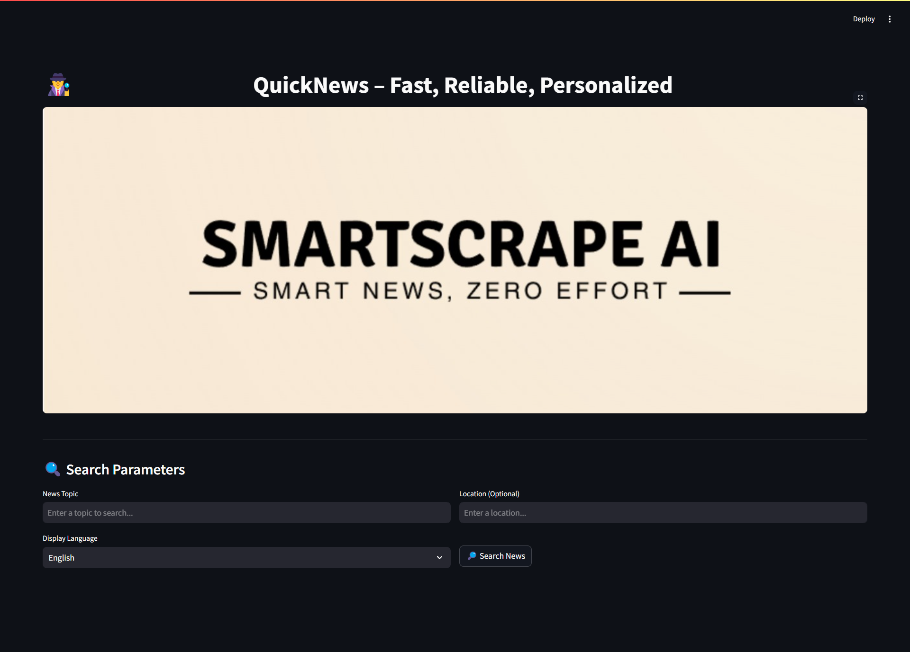

# QuickNews - Autonomous AI News Agent 🤖📰

QuickNews is an intelligent AI agent that autonomously searches, summarizes, and publishes news articles. Built for the Flipr Hackathon 25, it streamlines the process of gathering and publishing news content with zero human intervention.


## view our published news - https://testing-news.hashnode.dev/news-roundup-crime-in-india-1

# Proof
[View PDF](./assets/published_news.pdf)

## 🎯 Project Overview

QuickNews tackles the challenge of automated news aggregation and publishing through:
- Web crawling and data extraction from reliable news sources
- Intelligent content summarization and structuring
- SEO optimization for better discoverability
- Automated publishing to Hashnode
- Support for multiple languages
- AI-generated imagery for enhanced visual appeal

## 🛠️ Technical Approach

### Data Collection & Processing
- Utilizes DuckDuckGo API for fetching recent news articles
- Implements the `newspaper3k` library for article extraction and parsing
- Uses NLTK for natural language processing and text summarization

### Content Generation
- Employs extractive summarization techniques to maintain factual accuracy
- Generates SEO-optimized titles and descriptions
- Creates AI-generated illustrations using Pollinations.ai

### Publishing Pipeline
- Automatically formats content in Markdown
- Handles image processing and optimization
- Publishes directly to Hashnode using their GraphQL API
- Supports multiple languages through Google Translate integration

## ✨ Features

- 🌐 **Multi-source News Aggregation**: Fetches news from various reliable sources
- 📝 **Smart Summarization**: Creates concise, readable summaries while maintaining context
- 🎨 **AI Image Generation**: Enhances articles with relevant AI-generated illustrations
- 🌍 **Multilingual Support**: Supports 10+ languages including Hindi, Tamil, Bengali
- 📊 **Clean UI**: Built with Streamlit for a seamless user experience
- 🚀 **One-Click Publishing**: Direct integration with Hashnode for automated publishing

## 🔧 Setup & Installation

1. Clone the repository:
```bash
git clone https://github.com/yourusername/quicknews.git
cd quicknews
```

2. Install dependencies:
prefered python version is 3.12.9
```bash
pip install -r requirements.txt
```

3. Configure API tokens:
   - Open `Final_name.py`
   - Update the following values:
```python
self.api_token = "Your_hashnode_api"       
self.publication_id = "Publication_id"
```

4. Update image path in `Final_name.py`:
```python
st.image("/path/to/your/image-title.jpg", use_container_width=True)
```

5. Run the application:
```bash
streamlit run main.py
```

## 🎮 Usage

1. Launch the application using the command above
2. Enter your search topic in the "News Topic" field
3. (Optional) Specify a location for location-specific news
4. Select your preferred display language
5. Click "Search News" to fetch and process articles
6. Review the generated summaries
7. Click "Publish to Hashnode" to publish the compiled article

## 🔑 Required API Keys

- Hashnode API Token (for publishing)
- Hashnode Publication ID (for article destination)

## 🤝 Contributing

Feel free to fork the repository and submit pull requests. For major changes, please open an issue first to discuss the proposed changes.


## 🎓 Acknowledgments

- Built for Flipr Hackathon 25
- Uses the excellent [newspaper3k](https://newspaper.readthedocs.io/) python library
- Powered by [Streamlit](https://streamlit.io/) for the UI
- Special thanks to [Hashnode](https://hashnode.com/) for their GraphQL API

## 📞 Contact

For any queries regarding the project, feel free to reach out:
- Email: your.email@example.com
- LinkedIn: [Your Name](https://linkedin.com/in/yourprofile)
- Twitter: [@yourhandle](https://twitter.com/yourhandle)
